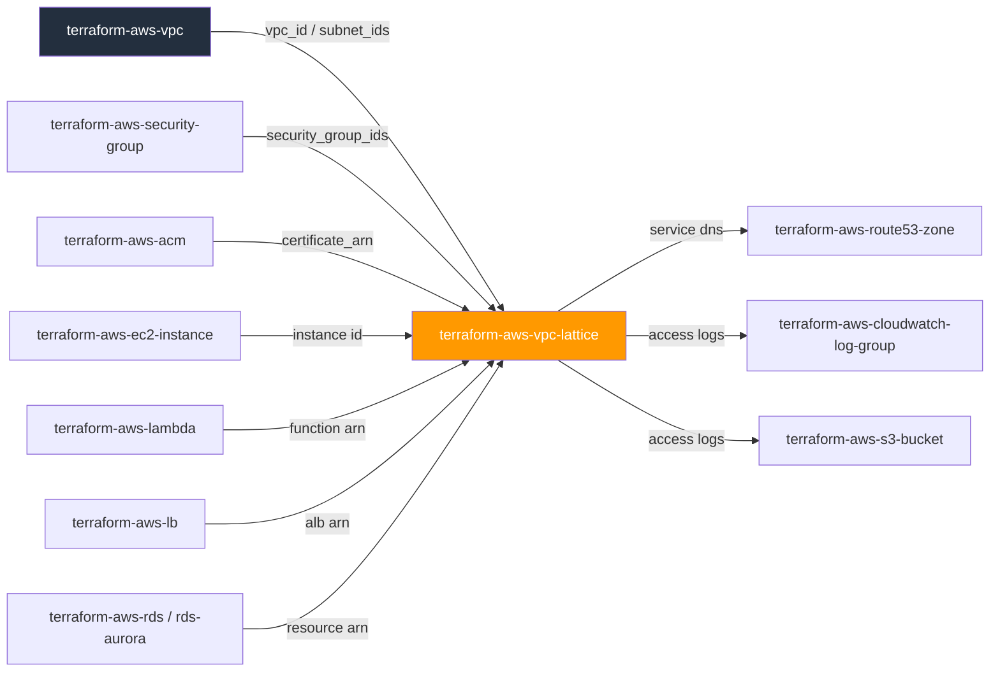
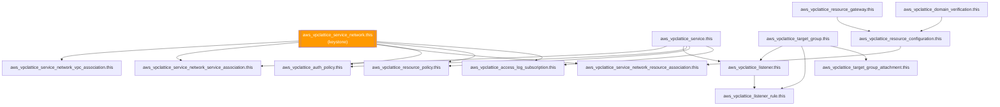

# 🟧 AWS **VPC Lattice** Terraform Module

> **Composite module that provisions a complete Amazon VPC Lattice application-networking mesh — service network, VPC/service/resource associations, services, target groups, listeners, listener rules, resource gateways, resource configurations, domain verification, IAM-shaped auth/resource policies, and access-log subscriptions — behind one deeply-typed boundary.** IAM-native, cross-VPC/cross-account application networking without PrivateLink/Transit-Gateway plumbing. Built for the AWS provider **v6.x**.


---

## 🧩 Overview

- 🕸️ Builds a **service network** — the IAM-authenticated mesh boundary that VPCs, services, and non-Lattice resources join
- 🔐 Defaults `auth_type` to **`AWS_IAM`** on the network and every service — open (`NONE`) is an explicit, documented opt-out
- 🧷 Wires **VPC associations** so consuming workloads can actually reach services on the mesh (this step is not implicit)
- 🎯 Models **target groups** for all four backend types — `INSTANCE`, `IP`, `LAMBDA`, `ALB` — as one deeply-typed, `validation`-enforced object
- 🚦 Renders **listeners** and **listener rules** with path/header/method matching and weighted forward/fixed-response actions
- 🌉 Optionally stands up **resource gateways** + **resource configurations** to reach on-prem/other-VPC/other-account resources (DNS name, IP, or ARN) — the RDS/on-prem bridge case
- 🌐 Supports **custom domains** end-to-end via `domain_verification` + the ACM `certificate_arn` on a service
- 📜 Renders **least-privilege auth/resource policies** from caller-supplied `jsonencode` documents — never synthesizes a wildcard policy for you
- 📝 First-class **access-log subscriptions** for the cross-VPC/cross-account audit trail a regulated FI needs
- 🏷️ `tags` flows to every taggable child resource; `tags_all` surfaced for governance — except the four resource types (`target_group_attachment`, `auth_policy`, `resource_policy`, `access_log_subscription`) whose AWS schema has no `tags` argument at all

> 💡 **Why it matters:** VPC Lattice replaces per-service PrivateLink endpoints and full-mesh Transit Gateway routing for HTTP(S)/gRPC application traffic with a single IAM-authenticated network object — this module gets a team from zero to a secure, audited service mesh in one call.

---

## ❤️ Support this project

If these Terraform modules have been helpful to you or your organization, I'd appreciate your support in any of the following ways:

- ⭐ **Star this repository** to help others discover this Terraform module.
- 🤝 **Connect with me on LinkedIn:** [linkedin.com/in/microsoftexpert](https://www.linkedin.com/in/microsoftexpert)
- ☕ **Buy me a coffee:** [buymeacoffee.com/microsoftexpert](https://buymeacoffee.com/microsoftexpert)

Whether it's a star, a professional connection, or a coffee, every gesture helps keep these modules actively maintained and continually improving. Thank you for being part of the community!

---

## 🗺️ Where this fits in the family



This module **consumes** a VPC id, security group ids, an ACM certificate ARN, and
target references (EC2 instance id, Lambda ARN, ALB ARN, or another resource's ARN);
it **emits** the service network `id`/`arn`, per-key service/target-group/listener
maps, and domain-verification TXT records. See the
[Cross-Module Contract](#-cross-module-contract).

---

## 🧬 What this module builds



---

## ✅ Provider / Versions

- Terraform `>= 1.12.0`
- `hashicorp/aws` `>= 6.0, < 7.0` (validated against v6.54.0)
- No `provider "aws" {}` block in this module — the caller's provider configuration
 (region, credentials, `default_tags`, `assume_role`) is inherited.

---

## 🔑 Required IAM Permissions

Least-privilege actions the Terraform identity needs (trimmed — see `SCOPE.md` for
the complete list):

| Action | Required for | Notes |
|---|---|---|
| `vpc-lattice:CreateServiceNetwork`, `DeleteServiceNetwork`, `GetServiceNetwork`, `UpdateServiceNetwork` | Service network lifecycle | Keystone |
| `vpc-lattice:CreateServiceNetworkVpcAssociation`, `DeleteServiceNetworkVpcAssociation` | VPC association | Required before workloads in that VPC can reach mesh services |
| `vpc-lattice:CreateService`, `DeleteService`, `GetService`, `UpdateService` | Service lifecycle | — |
| `vpc-lattice:CreateTargetGroup`, `DeleteTargetGroup`, `RegisterTargets`, `DeregisterTargets` | Target group + registration | — |
| `vpc-lattice:CreateListener`, `CreateRule`, `DeleteListener`, `DeleteRule` | Listener/rule lifecycle | — |
| `vpc-lattice:CreateResourceGateway`, `CreateResourceConfiguration` | Resource-gateway bridge (on-prem/other-VPC) | ENIs billed like a NAT gateway |
| `vpc-lattice:StartDomainVerification`, `GetDomainVerification` | Custom-domain proof | Pair with a Route 53 TXT record |
| `vpc-lattice:PutAuthPolicy`, `PutResourcePolicy` | Auth/resource-policy management | No `iam:PassRole` needed |
| `vpc-lattice:CreateAccessLogSubscription` | Audit-trail log delivery | — |
| `vpc-lattice:TagResource`, `UntagResource`, `ListTagsForResource` | Tagging | Not applicable to 4 resource types (see Architecture Notes) |

No service-linked role is auto-created by VPC Lattice, and no `iam:PassRole` is
required anywhere in this module — `AWS_IAM` auth policies are evaluated against
the caller's own SigV4 identity, not a role this module assumes.

---

## 📋 AWS Prerequisites

- **No service-linked role required** for VPC Lattice.
- **A VPC must be associated with the service network before its workloads can
 reach any service on it** — this is not implicit from creating a target group
 in that VPC. Every consuming VPC needs a `vpc_associations` entry.
- **VPC Lattice is the modern replacement for PrivateLink/Transit-Gateway-for-
 app-traffic** use cases — it trades per-service endpoints/full-mesh routing for
 a single IAM-authenticated network object.
- **Cross-account sharing** goes through AWS RAM for the service network, plus
 `aws_vpclattice_resource_policy` for principal-level control — RAM share setup
 is a prerequisite this module consumes, not one it performs.
- **Resource gateways need dedicated subnet capacity** (ENIs per AZ) — budget like
 a NAT gateway.
- **Region:** fully regional; **no us-east-1 constraint** (unlike CloudFront/
 WAFv2-CLOUDFRONT/ACM-for-CloudFront). A multi-Region mesh needs one service
 network per Region.
- **Quotas:** 3 service networks/account/Region (default, raisable); 50 VPC
 associations per service network; 200 services per service network; 10
 listeners per service; 10 rules per listener; 300 target groups per account/
 Region; 5 resource gateways per VPC (raisable).

---

## 📁 Module Structure

```
terraform-aws-vpc-lattice/
├── providers.tf
├── variables.tf
├── main.tf
├── outputs.tf
├── README.md
└── SCOPE.md
```

---

## ⚙️ Quick Start

```hcl
module "app_mesh" {
  source = "git::https://github.com/microsoftexpert/terraform-aws-vpc-lattice?ref=v1.0.0"

  service_network_name = "core-app-mesh"
  # auth_type defaults to "AWS_IAM" — secure baseline, no need to set it

  vpc_associations = {
    app = {
      vpc_id             = module.vpc.id
      security_group_ids = [module.app_sg.id]
    }
  }

  services = {
    orders = {
      certificate_arn = module.acm_orders.arn
    }
  }

  target_groups = {
    orders_ip = {
      type = "IP"
      config = {
        vpc_identifier = module.vpc.id
        port           = 443
        protocol       = "HTTPS"
      }
    }
  }

  listeners = {
    orders_https = {
      service_key = "orders"
      protocol    = "HTTPS"
      default_action = {
        type = "forward"
        forward = {
          target_groups = [{ target_group_key = "orders_ip" }]
        }
      }
    }
  }

  service_associations = {
    orders = { service_key = "orders" }
  }

  tags = {
    Environment = "prod"
    Owner       = "platform-eng"
  }
}
```

---

## 🔌 Cross-Module Contract

### Consumes

| Input | Type | Source module |
|---|---|---|
| `vpc_associations[*].vpc_id` | `string` | `terraform-aws-vpc` |
| `vpc_associations[*].security_group_ids` | `list(string)` | `terraform-aws-security-group` |
| `resource_gateways[*].vpc_id` / `subnet_ids` | `string` / `list(string)` | `terraform-aws-vpc` |
| `resource_gateways[*].security_group_ids` | `list(string)` | `terraform-aws-security-group` |
| `services[*].certificate_arn` | `string` (regional ACM ARN) | `terraform-aws-acm` |
| `target_groups[*].config.vpc_identifier` | `string` | `terraform-aws-vpc` |
| `target_group_attachments[*].target_id` | `string` (instance id / IP / Lambda ARN / ALB ARN) | `terraform-aws-ec2-instance` / `terraform-aws-lambda` / `terraform-aws-lb` |
| `resource_configurations[*].definition.arn_resource.arn` | `string` | e.g. `terraform-aws-rds`, `terraform-aws-rds-aurora` |
| `access_log_subscriptions[*].destination_arn` | `string` | `terraform-aws-cloudwatch-log-group` / `terraform-aws-s3-bucket` / `terraform-aws-kinesis-firehose` |

### Emits

| Output | Description | Consumed by |
|---|---|---|
| `id` | Service network id | tagging, cross-references |
| `arn` | Service network ARN — cross-resource reference type | RAM shares, auth/resource policies, cross-account associations |
| `name` | Service network name | audit |
| `service_ids` / `service_arns` | Map of service key → id/ARN | RAM shares, `terraform-aws-route53-zone` |
| `service_dns_entries` | Map of service key → DNS entry | Route 53 records |
| `target_group_ids` / `target_group_arns` | Map of target-group key → id/ARN | audit, external wiring |
| `listener_ids` / `listener_arns` | Map of listener key → id/ARN | import, audit |
| `listener_rule_ids` / `listener_rule_arns` | Map of listener-rule key → id/ARN | audit |
| `resource_gateway_ids` / `resource_gateway_arns` | Map of resource-gateway key → id/ARN | `terraform-aws-vpc` subnet planning |
| `resource_configuration_ids` / `resource_configuration_arns` | Map of resource-configuration key → id/ARN | resource-association wiring |
| `domain_verification_ids` | Map of domain-verification key → id | `resource_configurations[*].domain_verification_key` |
| `domain_verification_txt_records` | Map of domain-verification key → `{name, value}` | `terraform-aws-route53-zone` (TXT proof) |
| `auth_policy_states` | Map of auth-policy key → state | audit |
| `access_log_subscription_arns` | Map of access-log-subscription key → ARN | audit |
| `tags_all` | All tags incl. provider `default_tags` | governance/audit |

---

## 📚 Example Library (copy-paste)

<details>
<summary><strong>1 · Minimal service network + VPC association</strong></summary>

```hcl
module "mesh" {
  source = "git::https://github.com/microsoftexpert/terraform-aws-vpc-lattice?ref=v1.0.0"

  service_network_name = "sandbox-mesh"

  vpc_associations = {
    dev = { vpc_id = module.vpc.id }
  }
}
```
</details>

<details>
<summary><strong>2 · IP-type target group with health checks</strong></summary>

```hcl
target_groups = {
  api_ip = {
    type = "IP"
    config = {
      vpc_identifier   = module.vpc.id
      ip_address_type  = "IPV4"
      port             = 443
      protocol         = "HTTPS"
      protocol_version = "HTTP1"
      health_check = {
        enabled                       = true
        health_check_interval_seconds = 20
        health_check_timeout_seconds  = 10
        healthy_threshold_count       = 5
        unhealthy_threshold_count     = 3
        matcher_value                 = "200-299"
        path                          = "/healthz"
        port                          = 8443
        protocol                      = "HTTPS"
      }
    }
  }
}
```
</details>

<details>
<summary><strong>3 · INSTANCE-type target group + static attachment</strong></summary>

```hcl
target_groups = {
  web_instances = {
    type = "INSTANCE"
    config = {
      vpc_identifier = module.vpc.id
      port           = 8080
      protocol       = "HTTP"
    }
  }
}

target_group_attachments = {
  web_1 = {
    target_group_key = "web_instances"
    target_id        = module.web_instance.id
  }
}
```
</details>

<details>
<summary><strong>4 · Lambda-type target group (no config block)</strong></summary>

```hcl
target_groups = {
  webhook = {
    type = "LAMBDA"
  }
}

target_group_attachments = {
  webhook_fn = {
    target_group_key = "webhook"
    target_id        = module.lambda_webhook.arn
  }
}
```
</details>

<details>
<summary><strong>5 · ALB-type target group (no health_check block)</strong></summary>

```hcl
target_groups = {
  legacy_alb = {
    type = "ALB"
    config = {
      vpc_identifier = module.vpc.id
      port           = 443
      protocol       = "HTTPS"
    }
  }
}

target_group_attachments = {
  legacy = {
    target_group_key = "legacy_alb"
    target_id        = module.legacy_lb.arn
  }
}
```
</details>

<details>
<summary><strong>6 · Weighted forward across two target groups (canary)</strong></summary>

```hcl
listeners = {
  api_https = {
    service_key = "api"
    protocol    = "HTTPS"
    default_action = {
      type = "forward"
      forward = {
        target_groups = [
          { target_group_key = "api_v1", weight = 90 },
          { target_group_key = "api_v2", weight = 10 },
        ]
      }
    }
  }
}
```
</details>

<details>
<summary><strong>7 · Listener rule with path + header matching</strong></summary>

```hcl
listener_rules = {
  admin_path = {
    listener_key = "api_https"
    priority     = 10
    match = {
      http_match = {
        header_matches = [{
          name  = "x-env"
          match = { exact = "staging" }
        }]
        path_match = {
          match = { prefix = "/admin" }
        }
      }
    }
    action = {
      type = "forward"
      forward = {
        target_groups = [{ target_group_key = "admin_ip" }]
      }
    }
  }
}
```
</details>

<details>
<summary><strong>8 · Fixed-response listener default action (404 catch-all)</strong></summary>

```hcl
listeners = {
  api_https = {
    service_key = "api"
    protocol    = "HTTPS"
    default_action = {
      type           = "fixed_response"
      fixed_response = { status_code = 404 }
    }
  }
}
```
</details>

<details>
<summary><strong>9 · Cross-account resource-gateway + resource-configuration (RDS by ARN)</strong></summary>

```hcl
resource_gateways = {
  onprem_bridge = {
    vpc_id     = module.vpc.id
    subnet_ids = module.vpc.private_subnet_ids
  }
}

resource_configurations = {
  shared_db = {
    resource_gateway_key = "onprem_bridge"
    protocol             = "TCP"
    port_ranges          = ["5432"]
    definition = {
      arn_resource = { arn = module.rds_aurora.arn }
    }
  }
}

resource_associations = {
  shared_db = { resource_configuration_key = "shared_db" }
}
```
</details>

<details>
<summary><strong>10 · Custom domain with verification</strong></summary>

```hcl
domain_verifications = {
  apps_example_com = { domain_name = "apps.example.com" }
}

services = {
  orders = {
    custom_domain_name = "orders.apps.example.com"
    certificate_arn    = module.acm_orders.arn
  }
}

# Publish the returned TXT record via terraform-aws-route53-zone:
# name = module.mesh.domain_verification_txt_records["apps_example_com"].name
# value = module.mesh.domain_verification_txt_records["apps_example_com"].value
```
</details>

<details>
<summary><strong>11 · Least-privilege auth_policy (jsonencode, no wildcard)</strong></summary>

```hcl
auth_policies = {
  orders_read_only = {
    resource_identifier_key = "orders" # a services map key, or "service_network"
    policy = jsonencode({
      Version = "2012-10-17"
      Statement = [{
        Effect    = "Allow"
        Principal = { AWS = "arn:aws:iam::111122223333:role/orders-reader" }
        Action    = ["vpc-lattice-svcs:Invoke"]
        Resource  = "*"
        Condition = {
          StringNotEqualsIgnoreCase = { "aws:PrincipalType" = "anonymous" }
        }
      }]
    })
  }
}
```
</details>

<details>
<summary><strong>12 · Access-log subscription to CloudWatch Logs (audit trail)</strong></summary>

```hcl
access_log_subscriptions = {
  mesh_audit = {
    resource_identifier_key = "service_network"
    destination_arn         = module.mesh_log_group.arn
  }
}
```
</details>

<details>
<summary><strong>13 · Secure-by-default opt-out (open auth for a public health endpoint)</strong></summary>

```hcl
# Documented exception: this one service is intentionally open (NONE) for an
# unauthenticated health-check endpoint. Every other service on the mesh keeps
# the AWS_IAM default.
services = {
  health = {
    auth_type = "NONE" # opt-out — documented exception, not the default
  }
}
```
</details>

<details>
<summary><strong>14 · Tags merging with provider default_tags</strong></summary>

```hcl
# Caller's provider block:
# provider "aws" {
# default_tags {
# tags = { CostCenter = "eng-platform", ManagedBy = "terraform" }
# }
# }

module "mesh" {
  source = "git::https://github.com/microsoftexpert/terraform-aws-vpc-lattice?ref=v1.0.0"

  service_network_name = "core-app-mesh"

  tags = {
    Environment = "prod" # merges with default_tags; resource tags win on key conflict
  }
}

# module.mesh.tags_all shows the merged result: CostCenter, ManagedBy, Environment
```
</details>

<details>
<summary><strong>15 · End-to-end composition (vpc → security-group → acm → lattice → lambda)</strong></summary>

```hcl
module "vpc" {
  source = "git::https://github.com/microsoftexpert/terraform-aws-vpc?ref=v1.0.0"
  name   = "core-vpc"
  cidr   = "10.20.0.0/16"
}

module "app_sg" {
  source = "git::https://github.com/microsoftexpert/terraform-aws-security-group?ref=v1.0.0"
  name   = "app-mesh-sg"
  vpc_id = module.vpc.id
}

module "acm_orders" {
  source      = "git::https://github.com/microsoftexpert/terraform-aws-acm?ref=v1.0.0"
  domain_name = "orders.apps.example.com"
}

module "lambda_orders" {
  source        = "git::https://github.com/microsoftexpert/terraform-aws-lambda?ref=v1.0.0"
  function_name = "orders-handler"
}

module "orders_log_group" {
  source = "git::https://github.com/microsoftexpert/terraform-aws-cloudwatch-log-group?ref=v1.0.0"
  name   = "/vpc-lattice/orders"
}

module "mesh" {
  source = "git::https://github.com/microsoftexpert/terraform-aws-vpc-lattice?ref=v1.0.0"

  service_network_name = "core-app-mesh"

  vpc_associations = {
    core = {
      vpc_id             = module.vpc.id
      security_group_ids = [module.app_sg.id]
    }
  }

  services = {
    orders = {
      custom_domain_name = "orders.apps.example.com"
      certificate_arn    = module.acm_orders.arn
    }
  }

  target_groups = {
    orders_fn = { type = "LAMBDA" }
  }

  target_group_attachments = {
    orders_fn = {
      target_group_key = "orders_fn"
      target_id        = module.lambda_orders.arn
    }
  }

  listeners = {
    orders_https = {
      service_key = "orders"
      protocol    = "HTTPS"
      default_action = {
        type    = "forward"
        forward = { target_groups = [{ target_group_key = "orders_fn" }] }
      }
    }
  }

  service_associations = {
    orders = { service_key = "orders" }
  }

  access_log_subscriptions = {
    orders_audit = {
      resource_identifier_key = "orders"
      destination_arn         = module.orders_log_group.arn
    }
  }

  tags = {
    Environment = "prod"
    Owner       = "platform-eng"
  }
}
```
</details>

---

## 📥 Inputs

**Core**
- `service_network_name` *(required)* — keystone service network name
- `auth_type` — `NONE` | `AWS_IAM` (default `AWS_IAM`, secure)

**Networking**
- `vpc_associations` — map of VPC-to-mesh joins
- `resource_gateways` — map of ENI-backed bridges to non-Lattice resources
- `resource_configurations` — map of non-Lattice resource descriptions (DNS/IP/ARN)
- `resource_associations` — map of resource-configuration-to-mesh joins

**Services & routing**
- `services` — map of routable Lattice services
- `service_associations` — map of service-to-mesh joins
- `target_groups` — map of INSTANCE/IP/LAMBDA/ALB target groups
- `target_group_attachments` — map of static target registrations
- `listeners` — map of front doors on a service
- `listener_rules` — map of path/header/method routing rules

**Custom domains**
- `domain_verifications` — map of domain-ownership proofs

**Governance**
- `auth_policies` — map of IAM-shaped auth documents
- `resource_policies` — map of cross-account sharing policies
- `access_log_subscriptions` — map of audit-log destinations

**Universal**
- `tags` — merged into every taggable child resource
- `timeouts` — applied to every child resource whose schema supports it

---

## 🧾 Outputs

- `id`, `arn`, `name`, `tags_all` — service network (keystone)
- `vpc_association_ids`, `vpc_association_arns`
- `service_ids`, `service_arns`, `service_dns_entries` *(`try(..., null)` — empty until the service reaches an active state)*
- `target_group_ids`, `target_group_arns`
- `listener_ids`, `listener_arns`, `listener_rule_ids`, `listener_rule_arns`
- `resource_gateway_ids`, `resource_gateway_arns`
- `resource_configuration_ids`, `resource_configuration_arns`
- `resource_association_ids`
- `domain_verification_ids`, `domain_verification_txt_records`
- `auth_policy_states`
- `access_log_subscription_arns`

No output in this module is marked `sensitive = true` — VPC Lattice does not
generate secrets (passwords, access keys); auth/resource policy documents are
caller-supplied and already visible in the caller's own configuration.

---

## 🧠 Architecture Notes

- **ARN format:** `arn:aws:vpc-lattice:<region>:<account>:servicenetwork/<id>`
 (service network); services, target groups, listeners, resource gateways, and
 resource configurations follow the equivalent `vpc-lattice:<region>:<account>:
 <resource-type>/<id>` shape.
- **Immutable / force-new fields:** `listener.name`/`port`/`protocol`;
 `access_log_subscription.destination_arn`/`resource_identifier`/
 `service_network_log_type`; `resource_gateway.resource_config_dns_resolution`.
- **`tags` ↔ `tags_all` ↔ provider `default_tags`:** resource tags win on key
 conflict; `tags_all` is the computed merge, surfaced only where the underlying
 resource exposes it. **Four resource types have no `tags` argument at all** in
 the live v6.54 schema: `aws_vpclattice_target_group_attachment`,
 `aws_vpclattice_auth_policy`, `aws_vpclattice_resource_policy`, and
 `aws_vpclattice_access_log_subscription` — `var.tags` is never applied to them.
- **`target_group.config` polymorphism:** the shape depends entirely on `type`.
 `LAMBDA` takes no `config` at all; `ALB` takes `config` but not `health_check`
 (unsupported); `INSTANCE`/`IP` take the full `config` + optional `health_check`.
 Enforced by `validation {}` on `var.target_groups`, not left to a runtime API
 error.
- **Eventual consistency:** newly created VPC/service/resource associations
 report `status = CREATE_IN_PROGRESS` briefly before `ACTIVE`; a dependent
 listener/rule apply immediately after can occasionally need a retry on a very
 fresh association.
- **Destroy ordering:** listener rules → listeners → target group attachments →
 target groups; service associations → services; VPC/resource associations →
 service network. Terraform sequences this via implicit `for_each` key
 references — no explicit `depends_on` needed.
- **No us-east-1 global-resource requirement** — VPC Lattice is fully regional,
 unlike CloudFront/WAFv2-CLOUDFRONT/ACM-for-CloudFront.
- **`auth_policy`/`resource_policy` policy strings must be built with
 `jsonencode`** — a policy string containing newlines or blank lines is
 rejected by the API.

---

## 🧱 Design Principles

- **`auth_type` defaults to `AWS_IAM`** on the service network and every service —
 set `auth_type = "NONE"` only as a documented, per-resource exception (see
 Example 13).
- **Auth/resource policies are never synthesized with a wildcard `Principal`** —
 the module only renders what the caller passes via `jsonencode`; there is no
 built-in permissive default to opt out of, by design.
- **Access-log subscriptions are a first-class, strongly recommended map** — an
 empty `access_log_subscriptions = {}` is allowed for a quick-start, but is a
 documented exception for anything PII-adjacent; wire at least one subscription
 per service network (or per sensitive service) in production.
- **Every child collection is `for_each` over `map(object(...))`** keyed by a
 stable caller string — no `count` — so adding/removing one entry never
 re-indexes another (mirrors `terraform-aws-lb`'s target-group/listener/rule
 pattern).
- **Deeply-typed `object` schemas throughout** — no `any`, no loose `map` for
 structured data — with `validation {}` blocks enforcing the closed value sets
 and type/config-shape consistency the provider itself can't express in HCL
 types alone (e.g. `target_groups[*].type` vs `config`/`health_check` shape,
 `resource_configurations[*].definition` exactly-one-of).

---

## 🚀 Runbook

```powershell
cd terraform-aws-vpc-lattice
terraform init -backend=false
terraform validate
terraform fmt -check

# plan/apply require valid AWS credentials (profile / SSO / OIDC) and a region:
# terraform plan
# terraform apply
# terraform output
```

> ⚠️ Always pin `?ref=v1.0.0` (an immutable tag), never a branch, when sourcing
> this module from the FinancialPartnerscasey GitHub organization.

---

## 🧪 Testing

- `terraform init -backend=false` — provider resolution only, no state backend
- `terraform validate` — structural/type validation (passed against
 `hashicorp/aws` v6.54.0 with zero errors)
- `terraform fmt -check` — formatting gate (clean)
- `pwsh C:\GitHubCode\Scripts\validate_all_modules.ps1` — shared multi-provider
 validator (`tflint` + `checkov`), producing `validation_report.html`
- No `terraform apply` is performed by this authoring process — an accountable
 human runs `apply` in a non-production account with a least-privilege role.

---

## 💬 Example Output

```
$ terraform output
id = "sn-0a1b2c3d4e5f6g7h8"
arn = "arn:aws:vpc-lattice:us-east-2:111122223333:servicenetwork/sn-0a1b2c3d4e5f6g7h8"
name = "core-app-mesh"
service_arns = {
 "orders" = "arn:aws:vpc-lattice:us-east-2:111122223333:service/svc-0f1e2d3c4b5a69788"
}
target_group_arns = {
 "orders_fn" = "arn:aws:vpc-lattice:us-east-2:111122223333:targetgroup/tg-0123456789abcdef0"
}
listener_arns = {
 "orders_https" = "arn:aws:vpc-lattice:us-east-2:111122223333:service/svc-0f1e2d3c4b5a69788/listener/listener-0a1b2c3d4e5f6g7h8"
}
```

---

## 🔍 Troubleshooting

- **A workload can't reach a service on the mesh even though everything looks
 "created"** — check `vpc_associations` first. Creating a target group in a VPC
 does not implicitly join that VPC to the service network; the association is
 a separate, required step.
- **Tag drift on plan** — usually a `default_tags`/resource-tags key collision.
 Resource tags win; avoid duplicating the same key in both places. Remember
 four resource types (`target_group_attachment`, `auth_policy`,
 `resource_policy`, `access_log_subscription`) have no tags at all — don't
 expect `tags_all` on those.
- **Credential-chain failures** — confirm `AWS_PROFILE`/SSO session or the OIDC
 role assumption succeeded before `plan`/`apply`; this module never accepts
 credentials as variables.
- **`Error: Invalid combination of arguments` on `resource_configuration`** —
 exactly one of `resource_gateway_key` / `resource_configuration_group_key`
 must be set, and exactly one of `definition.dns_resource` /
 `ip_resource` / `arn_resource`. The module's `validation {}` blocks should
 catch this at `plan` time; if you see it from the AWS API instead, check for
 a `CHILD`-type entry pointing at a non-`GROUP` parent.
- **IAM permission denials on `PutAuthPolicy`/`PutResourcePolicy`** — confirm the
 Terraform identity has the `vpc-lattice:PutAuthPolicy`/`PutResourcePolicy`
 action; these are separate from the `Create*`/`Get*` actions on the
 underlying service network/service.
- **Auth policy applied but traffic still unauthenticated / still denied** —
 `auth_policy` is only *active* while the target's `auth_type` is `AWS_IAM`; a
 policy on a `NONE`-auth resource is stored but inert. Check `auth_policy_states`
 output.
- **Access-log subscription won't update in place** — `destination_arn`,
 `resource_identifier`, and `service_network_log_type` are all FORCE-NEW;
 redirecting logs to a new destination replaces the subscription (brief gap in
 delivery, not a rolling update).
- **Destroy hangs on a resource gateway** — its ENIs, like a NAT gateway's,
 detach asynchronously; a dependent subnet/security-group deletion may need a
 retry.

---

## 🔗 Related Docs

- Terraform Registry — `hashicorp/aws` provider, VPC Lattice resource family
 (`aws_vpclattice_service_network`, `aws_vpclattice_service`,
 `aws_vpclattice_target_group`, `aws_vpclattice_listener`,
 `aws_vpclattice_listener_rule`, `aws_vpclattice_resource_gateway`,
 `aws_vpclattice_resource_configuration`, and associations/policies/logging)
- AWS documentation — Amazon VPC Lattice user guide (service networks, listeners
 and rules, target groups, resource configurations, access logging, auth
 policies)
- AWS documentation — AWS Resource Access Manager (cross-account service-network
 sharing)

---

> 🧡 *"Infrastructure as Code should be standardized, consistent, and secure."*
